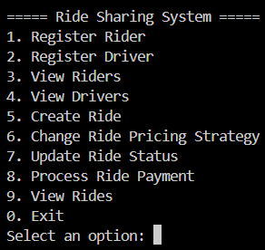

# RideSharing

Console-based ride sharing system implemented in C# with focused use of OOP fundamentals and classic design patterns (Factory, Singleton, Strategy, Adapter, Observer).

## Objective

The application supports:

- Rider and Driver registration
- Vehicle selection by type
- Centralized driver management
- Ride Creation with configurable pricing strategy
- Payment Processing through multiple methods
- Status-Driven notifications to rider and driver observers

## Prerequisites

- .NET SDK matching the project target in `RideSharing.csproj` (currently `net10.0`)
- Windows, macOS, or Linux shell with `dotnet` available in `PATH`

## How To Run

From the repository root:

```bash
dotnet restore
dotnet run --project RideSharing.csproj
```

## Interactive Features

The menu in `Program.cs` provides end-to-end flows:

1. Register Rider
2. Register Driver
3. View Riders
4. View Drivers (all, or available by vehicle type)
5. Create Ride
6. Change Ride Pricing Strategy
7. Update Ride Status (enforced flow)
8. Process Ride Payment (bKash or Credit Card)
9. View Rides
0. Exit

## Screenshot



Console view of the menu-driven ride sharing workflow.

## Status Lifecycle

Ride status transitions are validated in `Rides/Ride.cs`:

- `Requested -> Accepted -> In Progress -> Completed`

Invalid or out-of-order transitions are rejected.

## Input Validation Contract

Input validation is centralized in `Utils/ValidationHelper.cs` and invoked from `Program.cs`. Key guarantees:

- Names cannot contain numeric characters.
- Phone and bKash numbers must be valid Bangladesh mobile numbers and are normalized to `+880` format.
- Phone numbers must be unique across both riders and drivers.
- Wallet balance must be at least `6`, and ride affordability checks prevent creating, repricing, or paying rides that exceed wallet balance.

## Project Layout

```text
RideSharing/
+-- Program.cs
+-- Users/
|   +-- User.cs
|   +-- Rider.cs
|   +-- Driver.cs
+-- Vehicles/
|   +-- IVehicle.cs
|   +-- Bike.cs
|   +-- CNG.cs
|   +-- Car.cs
|   +-- VehicleFactory.cs
+-- Management/
|   +-- RideManager.cs
+-- Rides/
|   +-- Ride.cs
+-- Pricing/
|   +-- IPricingStrategy.cs
|   +-- StandardPricing.cs
|   +-- RushHourPricing.cs
|   +-- MidnightPricing.cs
+-- Payments/
|   +-- IPaymentProcessor.cs
|   +-- BkashPaymentGateway.cs
|   +-- BkashPaymentAdapter.cs
|   +-- CreditCardProcessor.cs
+-- Observers/
|   +-- IRideObserver.cs
|   +-- RiderNotifier.cs
|   +-- DriverNotifier.cs
+-- Utils/
    +-- ValidationHelper.cs
```

## Design Patterns And Locations

### Factory Pattern

- `Vehicles/IVehicle.cs`
- `Vehicles/Bike.cs`
- `Vehicles/CNG.cs`
- `Vehicles/Car.cs`
- `Vehicles/VehicleFactory.cs`

`VehicleFactory.CreateVehicle(string type)` creates concrete vehicle implementations from a simple input token.

### Inheritance And Polymorphism

- `Users/User.cs` (abstract base)
- `Users/Rider.cs`
- `Users/Driver.cs`

`User` defines common identity and contract methods; `Rider` and `Driver` extend with role-specific state and behavior.

### Singleton Pattern

- `Management/RideManager.cs`

`RideManager.GetInstance()` provides a single process-wide driver registry with operations for registration, listing, and filtering.

### Strategy Pattern

- `Pricing/IPricingStrategy.cs`
- `Pricing/StandardPricing.cs`
- `Pricing/RushHourPricing.cs`
- `Pricing/MidnightPricing.cs`
- `Rides/Ride.cs` (`SetPricingStrategy`, `CalculateFare`)

Pricing logic is swappable at runtime without changing ride orchestration code.

### Adapter Pattern

- `Payments/IPaymentProcessor.cs`
- `Payments/BkashPaymentGateway.cs` (external-style gateway API)
- `Payments/BkashPaymentAdapter.cs`
- `Payments/CreditCardProcessor.cs`

`BkashPaymentAdapter` wraps the gateway and normalizes it to `IPaymentProcessor`.

### Observer Pattern

- `Observers/IRideObserver.cs`
- `Observers/RiderNotifier.cs`
- `Observers/DriverNotifier.cs`
- `Rides/Ride.cs` (`AddObserver`, `SetStatus`)

Observers subscribe to rides and receive updates whenever status changes.

## Notes

- `Program.cs` intentionally keeps all console orchestration in one place for assignment visibility.
- Domain logic such as status transition validation and pricing calculation remains inside domain classes to avoid fragile UI-driven behavior.
